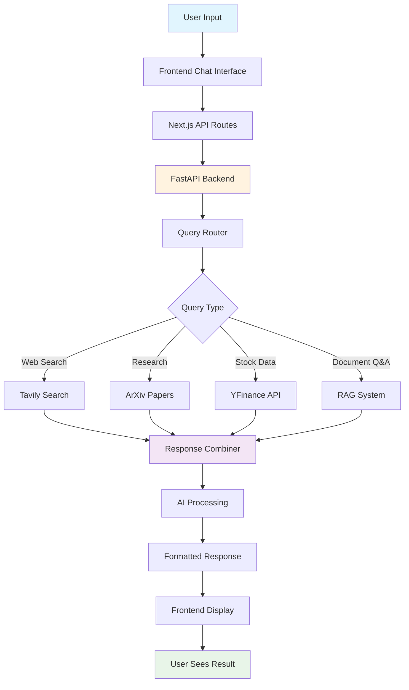
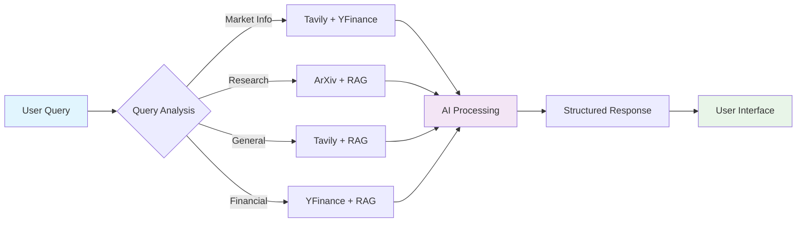

# Wealth Advisor AI - System Flow Diagram

## Simple Data Flow

## Component Overview

### Frontend Layer
- **Chat Interface**: User input and message display
- **Settings Modal**: API key management and preferences
- **Tool Status**: Real-time backend health monitoring

### API Gateway
- **Next.js Routes**: Frontend API endpoints
- **FastAPI Backend**: Main backend service
- **CORS Middleware**: Cross-origin request handling

### Backend Services
- **Query Router**: Categorizes and routes user queries
- **Tool Manager**: Manages external tool connections
- **Response Combiner**: Merges results from multiple tools
- **Analytics Tracker**: Usage metrics and health monitoring

### External Tools
- **Tavily Search**: Web search and news
- **ArXiv Research**: Academic papers and research
- **YFinance**: Real-time stock and financial data
- **RAG System**: Document-based knowledge retrieval

### Data Layer
- **PDF Processor**: Document text extraction
- **Vector Store**: Embeddings and similarity search
- **API Services**: External API integrations

## Key Data Flow Steps

1. **User Input** → User types question in chat interface
2. **Query Processing** → Backend categorizes and routes the query
3. **Tool Selection** → Appropriate tools are selected based on query type
4. **Data Retrieval** → Tools fetch relevant information
5. **Response Generation** → AI processes and combines results
6. **Format & Display** → Formatted response sent to frontend
7. **User Feedback** → User receives comprehensive answer

## Tool Integration Flow

This flow diagram shows how the Wealth Advisor AI system processes user queries through multiple specialized tools and returns comprehensive, AI-enhanced responses. 